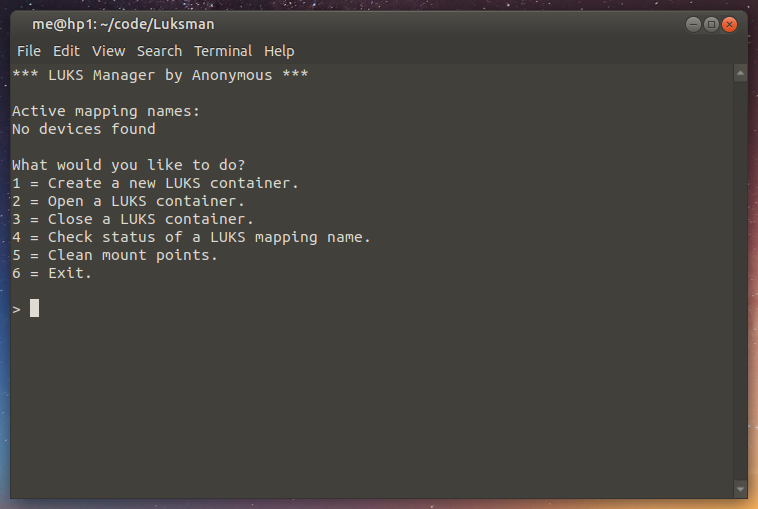

# Luksman

A simple LUKS container manager through the CLI. Disclaimer: I did not create this project, but I did modify its code to improve usability. Credits for the original code go to an online member of a Matrix room.
